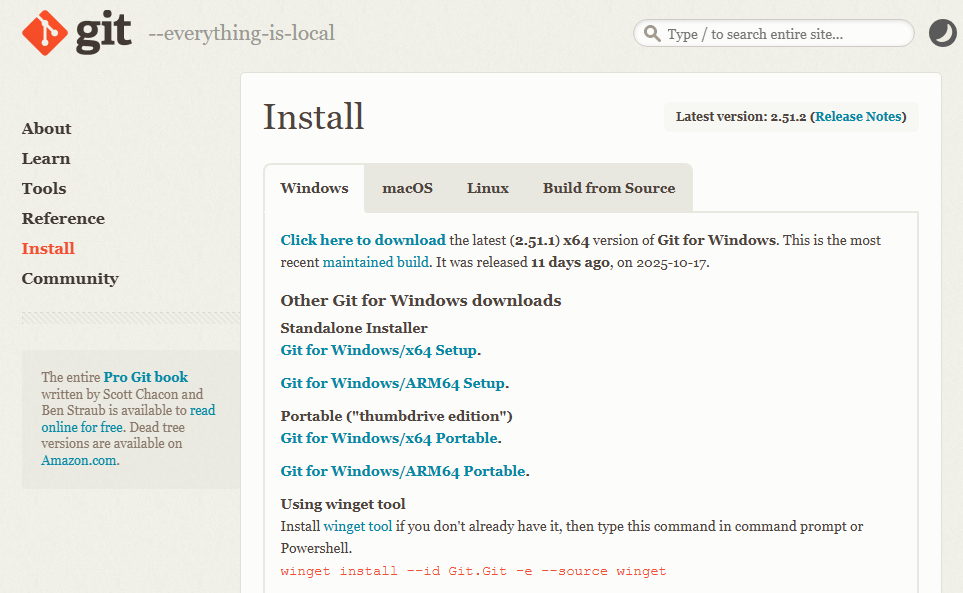
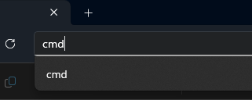
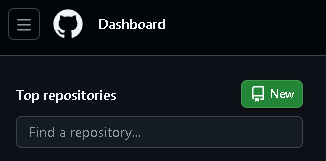

# How to Set Up Git

1. Go to this link (https://git-scm.com).
2. Click Install.

    
3. Download the installer that matches your operating system.

    
    4. Run the installer, then press next until it starts downloading.

---

# How to Set-Up Github and Visual Studio Code

In order to sync your activities from Visual Studio code to your chosen Github repository, follow the steps below:

1. Make sure that your Visual Studio Code is connected to your Github account.
2. Create a new folder and open it.
3. Click the directory on top of the folder and type "cmd" to open the command prompt on your designed folder.

    
4. Type "code ." in the command promt to open visual studio code.

    

5. Go to your github account and on your home page, click "New" located on top left of your page. Name your repository and click create. Keep the repository public so people can view it.

    

   

6. Back to VS Code. On the bottom right part of VS code, click the drop down bottom beside the "+" icon and click "Git Bash"

    

    

7. For source control purposes, paste each line separately in the terminal. Change the text with "" to your name and email address.

    git config --global user.name "Your Name"

    git config --global user.email "you@youraddress.com"

    git config --global push.default matching

    git config --global alias.co checkout

    git init

8. You will see that when you change something inside your Visual Studio Code, your source control will notify you of the changes.

    Click the "+" on each changes to stage changes.
    
    

    Then, click the circle icon (conventional commit).

    

    These tabs will open, select features and no scope.

    

    

    On the next tab, you can select what appropriate emoji will be attributed to the change that you made.

    

    Next, you could press enter on the last two tabs most of the time unless you have something to input on it.

    Lastly, click on sync changes. After loading, you can check your github repository if the sync is successful

    
